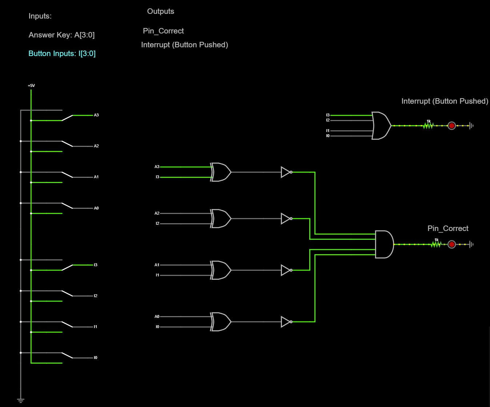

# Code Walkthrough

* [Hardware Logic](#hardware-logic) - Use of logic gates and additional circuit elements
* [Parameter Set Up](#parameter-set-up) - boolean and array declaration
* [Interrupts](#interrupts) - button-press interrupt
* [Timer Implementation](#timer-implementation) - 1 second timer interrupt
* [Functions](#functions) - Logic of software


## Hardware Logic

### Answer Comparator
Made up of a 2-Input XNOR gate and a 4-Input AND gate: <br>
**_INPUTS_**: 4 button states, 4 corect answer states (HIGH or LOW)<br>
**_OUTPUTS_**: Correct answer (HIGH or LOW)

* XNOR- Takes the input of the input button state and the correct button state to check if they are the same or not (does this for all buttons)
* AND- Takes 4 outputs from XNOR gate and checks if they are all outputs are the same
### Button Interrupt
Made up of a 4-Input OR gate: <br>
**_INPUTS_**: 4 button states(HIGH or LOW)<br>
**_OUTPUTS_**: Inperrupt pin (HIGH or LOW)

* OR- Takes the inputs from all input buttons ot check if any have been pressed


## Parameter Set Up
#### Variable types
* **_Volatile bool_**- Allows for boolean flags to change unexpectedly by ISR (used for action flags); ensures the compiler follows the specified order in the code instead of optimizing read/write operations 
* **_const int 2D array_**- interger array storing the button states corresponding to the correct answer
* **_const char 2D array_** - text array to store questions, and each possible answer


#### Question Array
Each question is stored in `questions**`, formatted in the following format with the question first then the possible answers for A, B, C, and D.
```
 {"Who is/are the best TA(s) in this class?",                            
  "A: They both suck", "B: Marco", "C: Liam", "D: We have TAs?"}
```
#### Answer Key
The answers to each of the defined questions are stored in `answer_key**`, where each of the four values represents the state of each button (A, B, C, D) corresponding to the correct answer.
```
{0, 1, 1, 0}             // Where the answer is B and C
```


## Interrupts
* **_Pin_** = `pin_input_interrupt`, pin 2
* **_Pin Value_** = OR of button inputs
* **_Function Call_** = `interrupt()`, where getAnswerFlag is checked
* **_Trigger_** = `CHANGE`, where interrupt is triggered on both rising and falling edges of any button press

The interrupt setup is as follows:<br>
`attachInterrupt(digitalPinToInterrupt(pin_input_interrupt), interrupt, CHANGE);`


```
void interrupt(){
  if(secondsCounterAnswer >= time_submit) {                               // Check if button has been held to submit 
    getAnswerFlag = true;}                                                // Set flag to true to allow answer to be checked

  if(end_reset == true){                                                  // Check if reset button is pressed
    if(current_question > 10){                                            // Check if game is over
      end_reset = false;                                                  // Ensure Rest button action is only triggered once
      current_question = 1;                                               // Reset game to the beginnning
      getAnswerFlag = false;                                              // Reset getAnswerFlag to false
      secondsCounterSpent = 0;                                            // Reset counter for time spent on question                        
      secondsCounterAnswer = 0;                                           // Reset everything to beginning states
      right_answer = false;
      question_asked = false;
      end_stats_printed = false;
      led_submit = true;
      score_bonus_counter = 0;                                            // Resets bonus points collected 
      score_correct_counter = 0;                                          // Resets correct answers
      score_total = 0;                                                    // Resets total score value
    }
    
    if(current_question < 10 && current_question > 1){                    // Check if reset buttons is pushed before game is over but passed question 1
      end_reset = false;                                                  // Ensure Rest button action is only triggered once                                         
      current_question = 11;                                              // Ends game
      end_stats_printed = false;                                          // Triggers end stats to be printed 
    }
  }
}
```


## Timer Implementation
**TCCR1A**
* Defines the timer mode
* 0 = Normal Mode
* 5, 6, 7, 14, 15 = Fast PMW Mode used for signal control
* 1, 2, 3, 10, 11 = Smooth PMW Mode used for servo control

**TCNT1** 
* Timer counter- part that increments
* Reset Timer 1 counter to 0 during setup

**OCR1A**
* Compare match value determines the number of cycles that need to occur before incrementing counter
* Value determined by (Arduino Opperating Frequency)/(Prescler * Desired Interrupt frequency)-1
* 15624 = (16 MHz)/(1024*1)-1

**TCCR1B** 
* **CS**
  * Defines the prescaler using CS12, CS11, CS10 as 3 selector bits
  * (1 << CS12) | (1 << CS10) = 101 (001 = 1, 010 = 8, 011 = 64, 100 = 256, 101 = 1024)
  * Chose 1024 since is the largest prescaler and will reduce the clock rate the most (intend to have 1-sec timer)
* **WG**
  * (1 << WGM12) = CTC Mode (Clear Timer on Compare Match)
  * Every time OCR1A is reached, timer resets to 0 and continues counting

**TIMSK1**
* (1 << OCIE1A) Enables Timer 1 Compare Match to be an interrupt


```
  TCCR1A = 0; TCCR1B = 0;              // Clear Timer 1 control registers to ensure a clean setup
  TCNT1 = 0;                           // Reset Timer 1 counter to 0
  OCR1A = 15624;                       // Set Output Compare Register A for 1-second interrupts (16 MHz / 1024 prescaler)
  TCCR1B |= (1 << WGM12);              // Configure Timer 1 for CTC mode (Clear Timer on Compare Match)
  TCCR1B |= (1 << CS12) | (1 << CS10); // Set prescaler to 1024 (CS12 and CS10 bits)
  TIMSK1 |= (1 << OCIE1A);             // Enable Timer 1 Compare Match A interrupt                        
```
The timer interrupt function `TIMER1_COMPA_vect`for the code is triggered every second 

```
ISR(TIMER1_COMPA_vect) {                            // Defines Interrupt Timer
  secondsCounterSpent++;                            // Increment time spent on question by 1 second
  if(secondsCounterSpent >= time_limit_question){   // Check if time limit has been reached
    limitFlag = true;}                              // Set time limit flag to true if reached
  
  if(digitalRead(pin_input_interrupt) == HIGH){     // Check if any button has been pressed
    if(secondsCounterAnswer >= time_submit){        // Check if button has been held long enough to submit
      led_submit = true;}                           // Flag to indicate blue LED to turn on (button can be released to submit question)
    else{led_submit = false;}                       // If button not held long enough blue should turn off
    secondsCounterAnswer++;}                        // Increment answer counter by 1 while any button stays pushed
    
  if(digitalRead(pin_input_interrupt) == LOW){      // Check that no buttons are pressed
    secondsCounterAnswer = 0;}                      // Reset answer counter since buttons not held 

  if(digitalRead(pin_end_reset) == HIGH){           // Check if end/reset button is pressed
    end_reset = true;                               // Set end reset flag to true if button is pressed
  }  
} 
```


## Functions
#### Ask Question

```
void ask_question(){                                                      
  Serial.print("Question "); Serial.print(current_question);              // Prints current question
  Serial.print(": ");
  for (int i = 0; i < 5; i++) {                                           // Iterate through question and each of 4 answers
    Serial.println(questions[current_question-1][i]);}                    // Print each element on a new line
  Serial.println("");
  question_asked = true;                                                  // Prevents question from being asked again
}
```

#### Get Right Answer

```
void get_right_answer(){                                                   // Function to check if submitted answer is correct
  if(secondsCounterAnswer < time_submit){                                  // Only runs during the time button is pressed down before reaching 2 seconds (so interrupt can be triggered on CHANGE because HIGH is invalid)
    int input_answer = current_question - 1;
    digitalWrite(pin_answerkey_0, answer_key[input_answer][0]);            // Writes the answer of current_question to pins (INPUT that compares with button states to determine if answer is correct)
    digitalWrite(pin_answerkey_1, answer_key[input_answer][1]);            // Feeds correct answer key into AND gate to be compared to submitted answer
    digitalWrite(pin_answerkey_2, answer_key[input_answer][2]);
    digitalWrite(pin_answerkey_3, answer_key[input_answer][3]);
    if(digitalRead(pin_correct) == HIGH){                                  // Signal storing score for current question is HIGH if answer key mathes submitted answer
      right_answer = true;}
    if(digitalRead(pin_correct) == LOW){                                   // Signal storing score for current question is LOW if answer key does not match submitted answer
      right_answer = false;}
  }
}
```

#### Get Answer

```
void get_answer(){
  if (getAnswerFlag == true){                                              // Run function only when button has been held 
    if(right_answer == true){                                              // Check if question is correct 
      score_correct_counter++;                                             // Add 1 to score
      if(secondsCounterSpent < (time_limit_question/2)){                   // Check if time spent on question is less than half the limit
        score_bonus_counter++;}}                                           // Add 1 to bonus socre
    
    time_quiz = time_quiz + secondsCounterSpent;                           // Add time spent on current question to total time spent on quiz
    score_total = score_correct_counter + score_bonus_counter;             // Update total socre 
    print_quiz_stats();                                                    // Prints correct answer for current question, questions answered correctly, bonus points, and total score to date
    reset_answer_pins();                                                   // Sets answer_key pins back to 0 while not answer input is being taken
    current_question++;                                                    // Moves on to next question
    getAnswerFlag = false;                                                 // Reset getAnswerFlag to false
    secondsCounterSpent = 0;                                               // Reset counter for time spent on question                        
    secondsCounterAnswer = 0;                                              // Resets counter for button pressed 
    right_answer = false;                                                  // Resets right answer to false
    question_asked = false;                                                // Triggers next question to be asked 
    led_submit = true;                                                     // should this not be flase if we are resetting everything?
  } 
  time_is_up();                                                            // Checks if time limit has been reached, if so, moves to next question
}
```

#### Print Quiz Stats

```
void print_quiz_stats(){                                                   // Stats displayed after each question 
    Serial.print("The correct answer for question ");                      // Print statement with correct answer
    Serial.print(current_question); Serial.print(" is ");
    for (int i = 0; i < 4; i++) {
      Serial.print(answer_key[current_question-1][i]);                     // Prints each value from answer_key for the current question
      Serial.print(" ");}
    Serial.println();
    Serial.print("Questions answered correctly: ");                        // Prints number of questions answered coreectly so far
    Serial.println(score_correct_counter);
    Serial.print("Your bonus points: ");                                   // Prints number of bonus points accumulated so far
    Serial.println(score_bonus_counter);
    Serial.print("Your total score: ");                                    // Prints total score to date
    Serial.println(score_total);
    Serial.println();
}
```

#### Reset Answer Pins

```
void reset_answer_pins(){
  digitalWrite(pin_answerkey_0, LOW);                                       // Sets pins for answer_key values back to 0
  digitalWrite(pin_answerkey_1, LOW);
  digitalWrite(pin_answerkey_2, LOW);
  digitalWrite(pin_answerkey_3, LOW);
}
```

#### Time is Up

```
void time_is_up(){                                          
  if (limitFlag == true) {                                                  // Check if time limit has been reached
    time_quiz=time_quiz + time_limit_question;                              // Add time limit to total time spent on quiz
    secondsCounterSpent = 0;                                                // Reset counter for time spent on question 
    limitFlag = false;                                                      // Reset time limti flag to false
    print_quiz_stats();                                                     // Print quiz stats
    current_question++;                                                     // Move to next question
    question_asked = false;                                                 // Trigger next question to be asked
  }
} 
```

#### Update LED Timer
```
void update_led_timer() {
  if(secondsCounterSpent < time_limit_question) {                         // LED timer runs while time limit is not up
    if (secondsCounterSpent <= time_limit_question * 0.25) {              // During 1st quarter of time limit
      set_led(1, 1, 1, 1);}                                               // All LEDs are on
    else if (secondsCounterSpent <= time_limit_question * 0.5) {          // During 2nd quarter of time limit
      set_led(1, 1, 1, 0);}                                               // 3 LEDs are on
    else if (secondsCounterSpent <= time_limit_question * 0.75) {         // During 3rd quarter of time limit
      set_led(1, 1, 0, 0);}                                               // 2 LEDs are on
    else {                                                                // During last quarter of time limit
      set_led(1, 0, 0, 0);}                                               // 1 lED is on
  }
  if(secondsCounterSpent == time_limit_question){                         // Once time limit is reached
    set_led(0, 0, 0, 0);}                                                 // All LEDs are off

  if(led_submit == true) {                                                // Check if button has been held long enouhg to submit answer
    digitalWrite(pin_led_submit, HIGH);}                                  // turn indicator light on
  if(led_submit == false) {                               
    digitalWrite(pin_led_submit, LOW);}                                   // turn indicator light off
  }
```

#### Set LED

```
void set_led(int led0, int led1, int led2, int led3){                     // Takes binary input (led0 = 1 or 0) to set leds
    digitalWrite(pin_led_0, led0);                                        // Updates state of LED output due to function input values
    digitalWrite(pin_led_1, led1);
    digitalWrite(pin_led_2, led2);
    digitalWrite(pin_led_3, led3);
  }
```


#### End of Quiz Stats

```
void end_of_quiz_stats(){
  while(end_stats_printed == false){                                       // While final stats are not being printed, print them if end_of_quiz stats() is called
    end_stats_printed = true;
    score_total = score_bonus_counter + score_correct_counter;             // Long number that adds total bonus poitns and total correct answers
    long percentage = (score_total * 100) / 20;                            // Performance grade in % 
    int total_time = time_quiz;                                            // Total time taken for whole quiz in seconds 
    time_avg_question = time_quiz/10;                                      // Average time taken per question = total quiz time / number of questions
    int avg_time = time_avg_question;                                      

    Serial.println();                                                      // Print final performance stats
    Serial.print("Your scored "); Serial.print(percentage); Serial.println("% on our quiz!!!");
    Serial.print("You spent ");Serial.print(time_quiz);Serial.println(" seconds on this quiz,");
    Serial.print("With an average time per question of ");Serial.print(avg_time);Serial.println(" seconds.");
    Serial.print("You answered ");Serial.print(score_correct_counter);Serial.print(" questions correctly, ");
    Serial.print("And you earned ");  Serial.print(score_bonus_counter);Serial.println(" bonus points from speedy responses!");
    Serial.println();

    Serial.println("END OF QUIZ");
    Serial.println("Push RED button to reset quiz");                      // Prompt reset of quiz
  }
}
```
